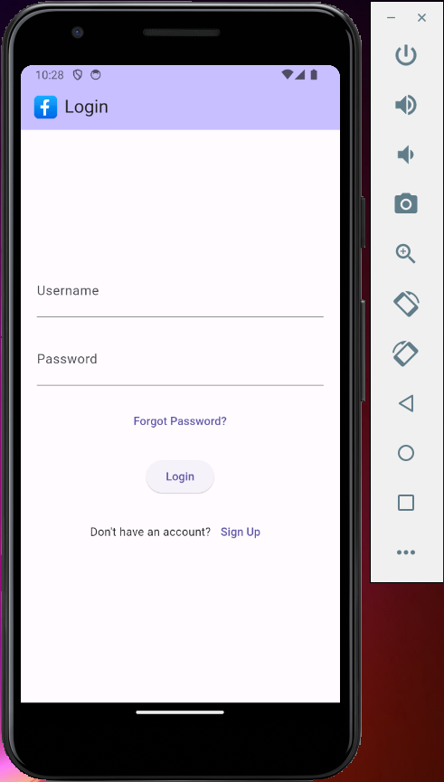
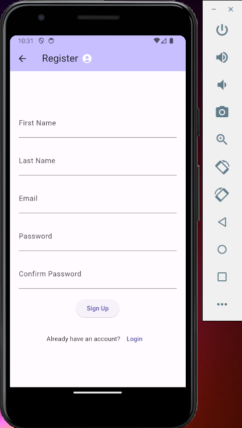
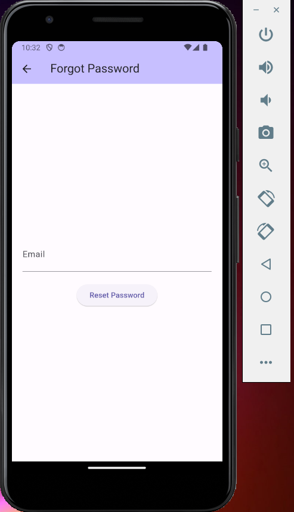

# Facebook Login UI

This Flutter project is a simple implementation of a UI similar to the Facebook login page.

## Features

- Facebook logo at the top of the page.
- Text fields for email/phone and password.
- "Forgot Password?" text.
- "Log In" button.
- "Create New Account" button.

## Getting Started

To run this project, follow these steps:

1. Clone this repository to your local machine using the following command:

2. Open the project in your preferred IDE or text editor.

3. Make sure you have Flutter installed on your machine.

4. Connect a device (emulator, simulator, or physical device) to your machine.

5. Run the app using the following command:

## Screenshots

Include screenshots or gifs of the app here.

.

.

.
